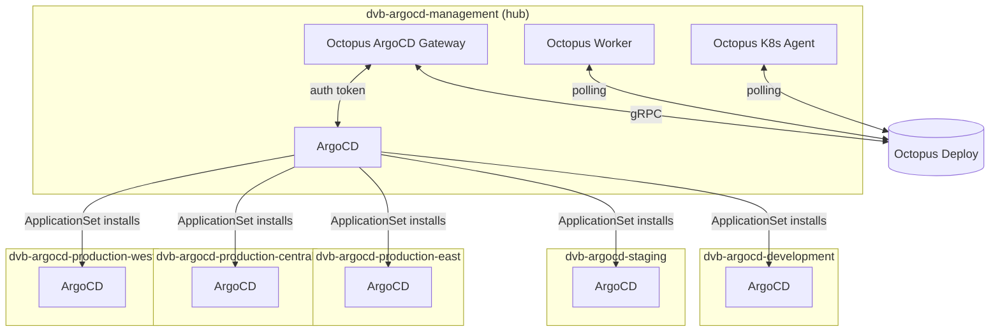
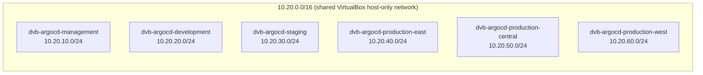
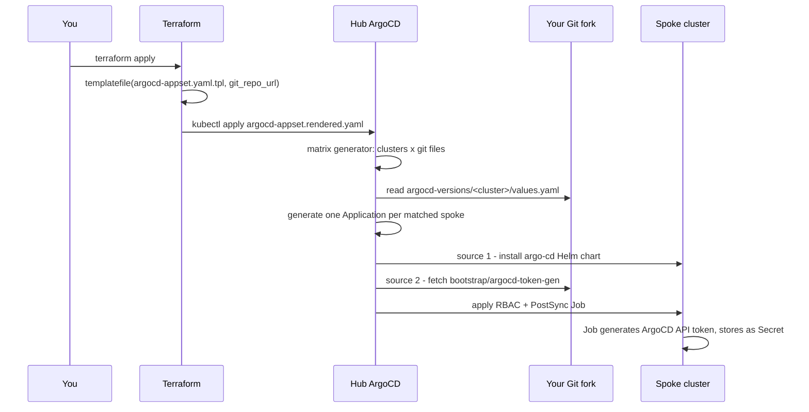

# dvb-argocd-rm

A homelab hub-and-spoke ArgoCD platform: six Vagrant-provisioned Kubernetes
clusters (one management "hub" + five spokes), wired together with
Terraform, ArgoCD ApplicationSets, and Octopus Deploy.

The management cluster runs ArgoCD and the Octopus ArgoCD Gateway. From
there, an ApplicationSet installs ArgoCD onto each spoke cluster
automatically, using a Git-driven per-cluster chart-version file so each
environment can be promoted independently.

## Architecture



Two distinct mechanisms both involve "spokes," worth keeping straight:

| Mechanism | Where it's defined | What it does |
|---|---|---|
| Cluster registration | `terraform/argocd-management-cluster/spoke-clusters.tf` + `modules/argocd-spoke-registration/` | Registers each spoke as an ArgoCD **Cluster** secret on the hub, so the hub's ArgoCD *knows about and can reach* each spoke's API server. |
| Spoke ArgoCD install | `terraform/argocd-management-cluster/argocd-appset.yaml.tpl` | An **ApplicationSet** that uses those registered clusters to *install ArgoCD itself* onto every spoke. |

## Network topology

All six clusters share a single `10.20.0.0/16` private network (one
VirtualBox host-only adapter, `netmask: 255.255.0.0`), so any node in any
cluster can reach any other cluster's API server directly — no static
routes needed. Each cluster gets its own `/24` slice:



Each control-plane node gets `.11` in its `/24`; workers start at `.21`.

## Repository structure

```
.
├── Vagrantfile                        # Provisions all 6 clusters
├── Generate-RemoteKubeconfig.ps1
├── argocd-versions/                   # Per-cluster ArgoCD chart version pins
│   ├── dvb-argocd-development/values.yaml
│   ├── dvb-argocd-staging/values.yaml
│   ├── dvb-argocd-production-east/values.yaml
│   ├── dvb-argocd-production-central/values.yaml
│   └── dvb-argocd-production-west/values.yaml
├── bootstrap/
│   └── argocd-token-gen/
│       └── manifests.yaml             # RBAC + PostSync Job, fetched by each spoke
└── terraform/
    └── argocd-management-cluster/     # Terraform root for the hub cluster
        ├── argocd.tf                  # Installs ArgoCD on the hub via Helm
        ├── argocd-appset.yaml.tpl     # ApplicationSet template (spoke installs)
        ├── git-repo-and-appsets.tf    # Repo credential + render/apply the ApplicationSet
        ├── spoke-clusters.tf          # Registers spoke clusters as ArgoCD Cluster secrets
        ├── modules/argocd-spoke-registration/
        ├── octopus-gateway.tf         # Octopus ArgoCD Gateway install
        ├── octopus-worker.tf          # Octopus Worker install
        ├── octopus-agent.tf           # Octopus Kubernetes Agent install
        ├── octopus-environments.tf    # Creates Octopus Environments
        ├── namespaces.tf
        ├── providers.tf
        ├── variables.tf
        ├── versions.tf
        ├── argo-rollouts.tf
        └── terraform.tfvars.example
```

## Host machine setup (Windows NUC)

This runs on a single Windows 11 box: VirtualBox/Vagrant manage the VMs
directly from Windows, while Terraform/kubectl/git are typically run from
inside WSL2 against the repo checked out on the Windows filesystem (this
is the pattern used throughout this README and its command examples).

### 1. Enable virtualization in BIOS/UEFI

Confirm Intel VT-x (or AMD-V) is enabled in the NUC's BIOS/UEFI before
installing anything below — both VirtualBox and WSL2 need it, and it's
off by default on some NUC firmware.

### 2. Install Chocolatey

From an **administrator** PowerShell prompt:

```powershell
Set-ExecutionPolicy Bypass -Scope Process -Force
[System.Net.ServicePointManager]::SecurityProtocol = [System.Net.ServicePointManager]::SecurityProtocol -bor 3072
iex ((New-Object System.Net.WebClient).DownloadString('https://community.chocolatey.org/install.ps1'))
```

Close and reopen the shell afterward so `choco` is on `PATH`.

### 3. Install required software

```powershell
choco install virtualbox -y
choco install vagrant -y
choco install terraform -y
choco install kubernetes-cli -y
choco install git -y
```

| Tool | Chocolatey package | Minimum version | Why |
|---|---|---|---|
| VirtualBox | `virtualbox` | 6.1+ | Runs the cluster VMs |
| Vagrant | `vagrant` | 2.2.19+ | Provisions the Vagrantfile |
| Terraform | `terraform` | **1.3+** | `optional()` in `variables.tf`'s `spoke_clusters` type requires it |
| kubectl | `kubernetes-cli` | any recent | Cluster access, kubeconfig merging |
| Git | `git` | any recent | Cloning your fork, pushing `argocd-versions/` changes |

A reboot after installing VirtualBox is recommended before first use.

### 4. Install WSL2

```powershell
wsl --install
```

Reboots when prompted, enables the "Virtual Machine Platform" and
"Windows Subsystem for Linux" Windows features, sets WSL2 as the default
version, and installs Ubuntu.

Inside the new Ubuntu shell, install matching Terraform/kubectl so
commands behave identically whether run from PowerShell or WSL:

```bash
sudo apt update
sudo apt install -y unzip curl gnupg software-properties-common

# Terraform
wget -O- https://apt.releases.hashicorp.com/gpg | sudo gpg --dearmor -o /usr/share/keyrings/hashicorp-archive-keyring.gpg
echo "deb [signed-by=/usr/share/keyrings/hashicorp-archive-keyring.gpg] https://apt.releases.hashicorp.com $(lsb_release -cs) main" | sudo tee /etc/apt/sources.list.d/hashicorp.list
sudo apt update && sudo apt install -y terraform

# kubectl
curl -LO "https://dl.k8s.io/release/$(curl -L -s https://dl.k8s.io/release/stable.txt)/bin/linux/amd64/kubectl"
sudo install -o root -g root -m 0755 kubectl /usr/local/bin/kubectl
```

Your Windows filesystem is reachable from WSL under `/mnt/c/...` — e.g. a
repo cloned to `C:\Users\<you>\src\dvb-argocd-rm` shows up at
`/mnt/c/Users/<you>/src/dvb-argocd-rm`. Run `vagrant`/`VBoxManage` commands
from PowerShell (VirtualBox VM management doesn't work from inside WSL),
and run `terraform`/`kubectl`/`git` from either shell against that same
path — WSL is what the command examples elsewhere in this README assume.

### 5. VirtualBox and WSL2 on the same machine

These two used to conflict outright (WSL2 requires Hyper-V; older
VirtualBox versions required exclusive access to VT-x). VirtualBox 6.1.18+
can run alongside Hyper-V/WSL2 using the Windows Hypervisor Platform
(WHPX) as its acceleration backend instead — Oracle still documents this
as "experimental," but it's the expected way to run both today, and no
`bcdedit` changes should be needed.

If a VM fails to boot with `VERR_NEM_NOT_AVAILABLE` or "VT-x is not
available": confirm both "Virtual Machine Platform" and "Windows
Hypervisor Platform" are enabled in Windows Features
(`optionalfeatures.exe`), and check that no per-VM nested-virtualization
setting is fighting with it.

### Additional prerequisites

- An Octopus Deploy instance and API key
- A fork of this repository, plus a GitHub personal access token (repo scope)

## Setup

### 1. Provision the clusters

```powershell
vagrant up
```

Brings up all 6 clusters (12 VMs by default: 1 control-plane + 1 worker
each). To bring up a subset while testing, e.g.:

```powershell
$env:CLUSTERS_TO_CREATE='dvb-argocd-management,dvb-argocd-development'
vagrant up
```

Resource note: all 6 clusters at once is 24 vCPU / ~48GB RAM at the
defaults (`CONTROL_PLANE_CPUS`/`MEMORY`, `WORKER_CPUS`/`MEMORY` env vars
override this).

This writes, per cluster, to the project root:

- `<cluster>-kubeconfig` — raw kubeconfig for that cluster
- `kubeconfigs/<cluster>.conf` — renamed export (cluster/user/context
  renamed from kubeadm's generic defaults, used for cross-cluster access)
- `join-commands/`, `worker-tracking/`, `logs/` — per-cluster provisioning
  state

### 2. Fork this repo

The only two things that change per fork are `git_repo_url` and
`github_api_token` in `terraform.tfvars` — nothing else in this project
needs hand-editing to point at a fork.

### 3. Configure Terraform

```powershell
cd terraform/argocd-management-cluster
cp terraform.tfvars.example terraform.tfvars
```

Fill in `terraform.tfvars`: Octopus connection details, `kubeconfig_path`
for the management cluster, `spoke_clusters` (paths to each spoke's
`kubeconfigs/<cluster>.conf` and its renamed context), and `git_repo_url` /
`github_api_token` for your fork.

### 4. Apply

```powershell
terraform init
terraform apply
```

This installs ArgoCD + the Octopus Gateway/Worker/Agent on the management
cluster, registers each spoke cluster as an ArgoCD Cluster secret, creates
a Git repository credential Secret for your fork, and renders + applies
`argocd-appset.yaml.tpl` to the management cluster's ArgoCD.

## How a spoke gets ArgoCD installed



The `ApplicationSet`'s cluster generator only matches cluster secrets
carrying an `env` label (set when each spoke is registered), which
naturally excludes ArgoCD's implicit `in-cluster` entry.

## Promoting an ArgoCD version to a spoke

Each spoke's ArgoCD chart version comes from
`argocd-versions/<cluster-name>/values.yaml` — a single
`targetRevision: "x.y.z"` field. Edit that file (via PR, or Octopus's
"Update Argo CD Application Manifests" step) and push; the generated
Application picks it up on its next sync. **Don't** edit
`argocd-appset.yaml.tpl` or the live `Application` object directly for
this — the ApplicationSet controller will just overwrite the latter back
to whatever the template says.

If a cluster's `values.yaml` is missing or its path doesn't match that
cluster's name exactly, that cluster is silently skipped — no error, no
Application generated for it.

## Octopus scoping annotations

Every spoke's generated Application carries annotations Octopus uses to
tie it to a Project/Environment/Tenant on its dashboard:

| Annotation | Value | Derived from |
|---|---|---|
| `argo.octopus.com/project` | `ArgoCD Management` | Fixed |
| `argo.octopus.com/environment` | e.g. `development`, `production` | First segment of the cluster name after stripping `dvb-argocd-` |
| `argo.octopus.com/tenant` | e.g. `east`, or empty | Second segment, if present (regional production clusters only) |

`dvb-argocd-production-east` → environment `production`, tenant `east`.
`dvb-argocd-development` → environment `development`, tenant absent
(annotation present but empty, not omitted — a constraint of how
ArgoCD's `goTemplate` engine renders values, not a choice).

## Getting cross-cluster `kubectl` access

Each control-plane exports a renamed kubeconfig to `kubeconfigs/<cluster>.conf`
during Vagrant provisioning. To merge them onto the management node into one
kubeconfig with a context per cluster, run the `merge-kubeconfigs`
provisioner (not run automatically, since it needs every desired cluster
to already be up):

```powershell
vagrant provision dvb-argocd-management-control-plane --provision-with merge-kubeconfigs
vagrant ssh dvb-argocd-management-control-plane
kubectl config get-contexts
kubectl config use-context dvb-argocd-production-east
```

## Common pitfalls (learned the hard way)

- **`templatefile()` treats every `${...}` as a real interpolation, even
  inside a comment.** Illustrative uses of that syntax in the `.tpl` file's
  own header comments have to be escaped as `$${...}`.
- **ArgoCD's `goTemplate: true` parses the `template:` block as YAML
  first, then substitutes into individual string values** — it does not
  render the whole file as text first the way Helm does. You can't use
  `{{- if }}...{{- end }}` to conditionally add or remove a whole YAML
  key; conditionals have to live *inside* a single scalar value instead.
- **Any YAML value that is entirely a `{{ ... }}` expression must be
  explicitly quoted** (`'{{ .foo }}'`), or YAML parses the leading `{` as
  the start of a flow-mapping and fails.
- **`argocd-appset.yaml.tpl` should contain exactly one YAML document** —
  the `ApplicationSet` only. The bootstrap RBAC/Job content belongs solely
  in `bootstrap/argocd-token-gen/manifests.yaml`, fetched by each spoke's
  Application, never applied directly to the management cluster.
- **Kubernetes Jobs have an immutable pod template.** If you ever see
  `field is immutable` from a `kubectl apply` against a Job, something is
  trying to update one in place rather than delete-and-recreate it — check
  for name collisions between resources meant for different clusters.