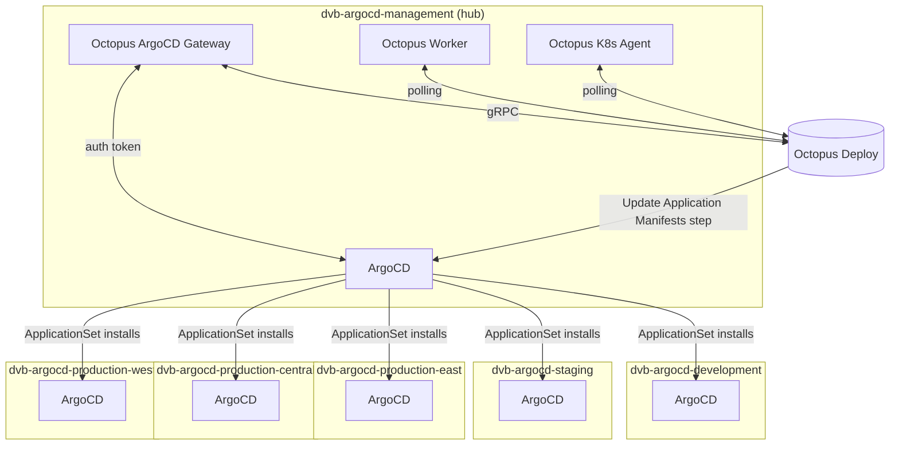
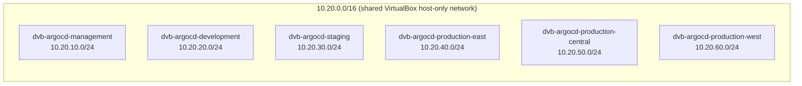
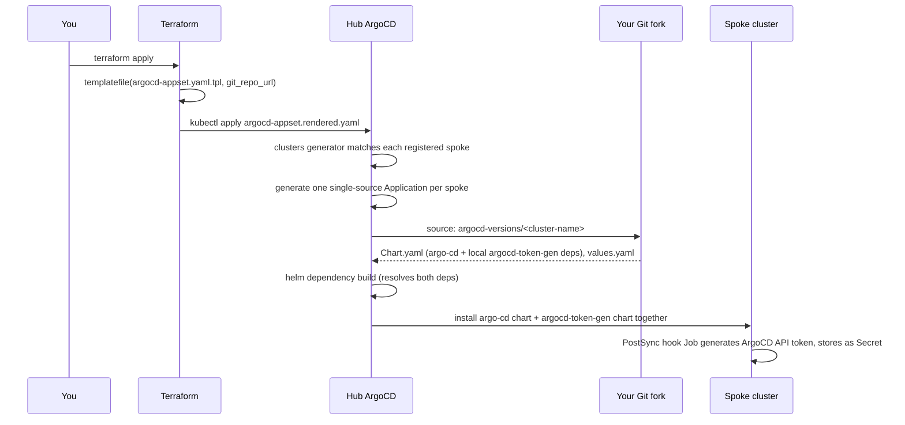
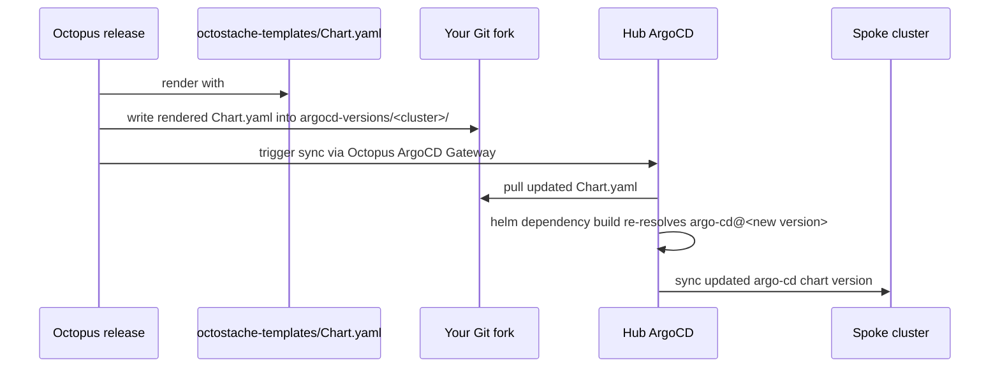
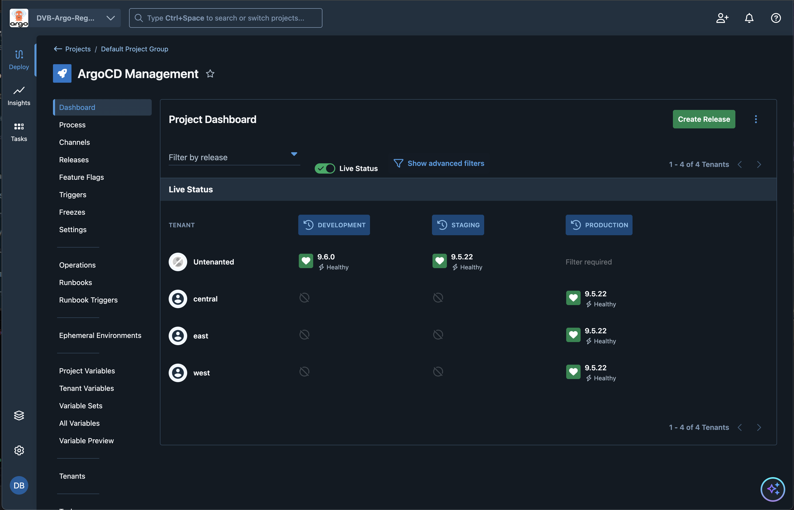
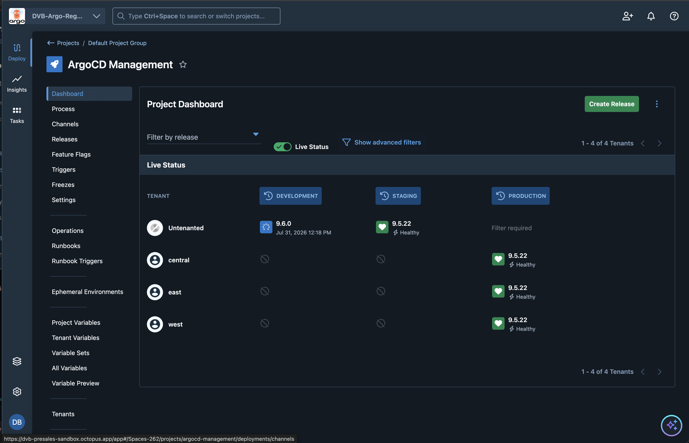
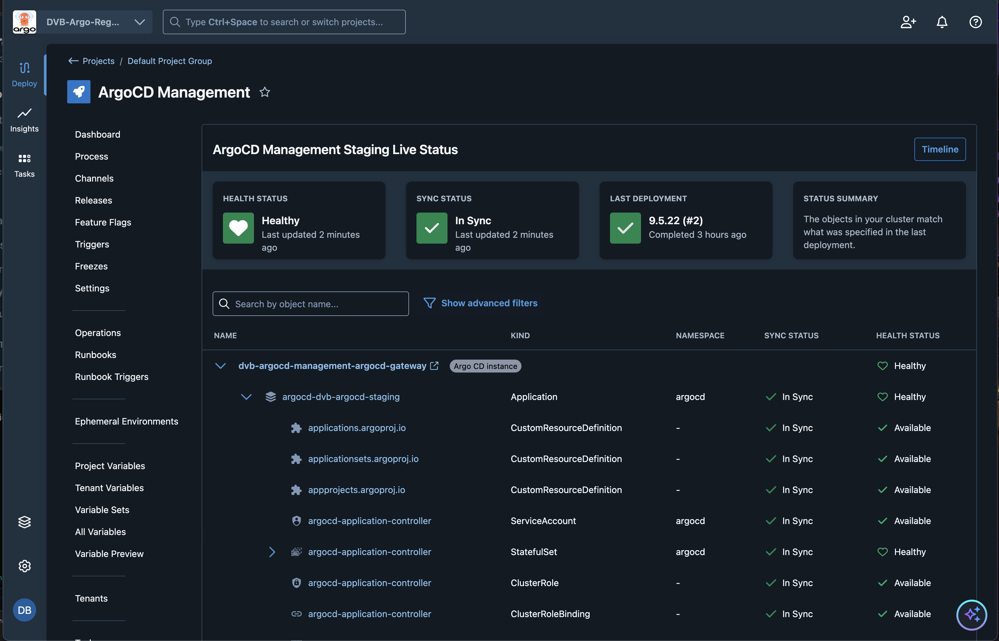
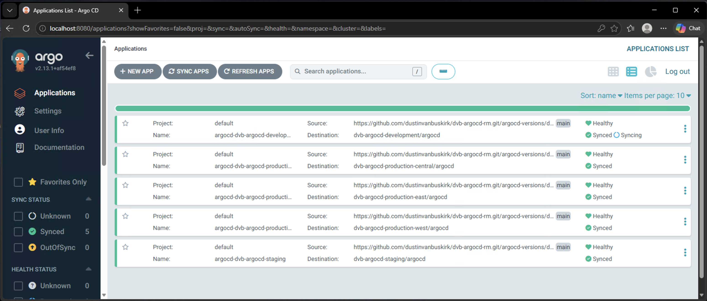

# dvb-argocd-rm

A homelab hub-and-spoke ArgoCD platform: six Vagrant-provisioned Kubernetes
clusters (one management "hub" + five spokes), wired together with
Terraform, an ArgoCD ApplicationSet, per-cluster Helm umbrella charts, and
Octopus Deploy driving version promotion.

The management cluster runs ArgoCD and the Octopus ArgoCD Gateway. From
there, an ApplicationSet installs ArgoCD onto each spoke cluster
automatically. Each spoke's ArgoCD chart version is promoted through
Octopus's own release/environment process, via its "Update Argo CD
Application Manifests" step -- not by hand-editing files or running
scripts.

## Architecture



Two distinct mechanisms both involve "spokes," worth keeping straight:

| Mechanism | Where it's defined | What it does |
|---|---|---|
| Cluster registration | `terraform/argocd-management-cluster/spoke-clusters.tf` + `modules/argocd-spoke-registration/` | Registers each spoke as an ArgoCD **Cluster** secret on the hub, so the hub's ArgoCD *knows about and can reach* each spoke's API server. |
| Spoke ArgoCD install | `terraform/argocd-management-cluster/argocd-appset.yaml.tpl` | An **ApplicationSet** that uses those registered clusters to *install ArgoCD itself* onto every spoke, via each cluster's own umbrella chart in `argocd-versions/`. |

## Network topology

All six clusters share a single `10.20.0.0/16` private network (one
VirtualBox host-only adapter, `netmask: 255.255.0.0`), so any node in any
cluster can reach any other cluster's API server directly -- no static
routes needed. Each cluster gets its own `/24` slice:



Each control-plane node gets `.11` in its `/24`; workers start at `.21`.

## Repository structure

```
.
├── Vagrantfile                        # Provisions all 6 clusters
├── Generate-RemoteKubeconfig.ps1
├── charts/
│   └── argocd-token-gen/              # Shared local Helm dependency:
│       ├── Chart.yaml                 # RBAC + PostSync hook Job that
│       ├── values.yaml                # generates the ArgoCD gateway
│       └── templates/                 # token on whatever cluster
│           ├── serviceaccount.yaml    # this chart is deployed to.
│           ├── role.yaml              # Referenced by every cluster's
│           ├── rolebinding.yaml       # umbrella chart as a local
│           └── job.yaml               # file:// dependency.
├── argocd-versions/                   # One umbrella chart per spoke
│   ├── dvb-argocd-development/
│   │   ├── Chart.yaml                 # Pins the argo-cd chart version --
│   │   │                              # overwritten by Octopus on deploy
│   │   └── values.yaml                # Helm values for argo-cd (static,
│   │                                  # git-committed, not templated)
│   ├── dvb-argocd-staging/
│   ├── dvb-argocd-production-east/
│   ├── dvb-argocd-production-central/
│   └── dvb-argocd-production-west/
├── octostache-templates/
│   └── Chart.yaml                     # Octostache template Octopus
│                                       # renders and writes into each
│                                       # cluster's own Chart.yaml above
└── terraform/
    └── argocd-management-cluster/     # Terraform root for the hub cluster
        ├── argocd.tf                  # Installs ArgoCD on the hub via Helm
        ├── argocd-appset.yaml.tpl     # ApplicationSet template (spoke installs)
        ├── git-repo-and-appsets.tf    # Repo credential + render/apply the ApplicationSet
        ├── spoke-clusters.tf          # Registers spoke clusters as ArgoCD Cluster secrets
        ├── modules/argocd-spoke-registration/
        ├── octopus-gateway.tf         # Octopus ArgoCD Gateway install
        ├── octopus-worker.tf          # Octopus Worker install
        ├── octopus-agent.tf           # Octopus Kubernetes Agent install
        ├── octopus-environments.tf    # Creates Octopus Environments
        ├── namespaces.tf
        ├── providers.tf
        ├── variables.tf
        ├── versions.tf
        ├── argo-rollouts.tf
        └── terraform.tfvars.example
```

`bootstrap/argocd-token-gen/manifests.yaml`, if still present, is no
longer used -- the RBAC/Job it held now lives once in
`charts/argocd-token-gen/` and gets pulled in as a Helm dependency by
every cluster instead of being referenced as a second Application source.
Safe to delete.

## Host machine setup (Windows NUC)

This runs on a single Windows 11 box: VirtualBox/Vagrant manage the VMs
directly from Windows (run from **PowerShell**), while Terraform/kubectl/git
run from **WSL2** against the repo checked out on the Windows filesystem
(this is the pattern the command examples below assume).

### 1. Enable virtualization in BIOS/UEFI

Confirm Intel VT-x (or AMD-V) is enabled in the NUC's BIOS/UEFI before
installing anything below -- both VirtualBox and WSL2 need it, and it's
off by default on some NUC firmware.

### 2. Install Chocolatey

From an **administrator** PowerShell prompt:

```powershell
Set-ExecutionPolicy Bypass -Scope Process -Force
[System.Net.ServicePointManager]::SecurityProtocol = [System.Net.ServicePointManager]::SecurityProtocol -bor 3072
iex ((New-Object System.Net.WebClient).DownloadString('https://community.chocolatey.org/install.ps1'))
```

Close and reopen the shell afterward so `choco` is on `PATH`.

### 3. Install required software

```powershell
choco install virtualbox -y
choco install vagrant -y
choco install terraform -y
choco install kubernetes-cli -y
choco install git -y
```

| Tool | Chocolatey package | Minimum version | Why |
|---|---|---|---|
| VirtualBox | `virtualbox` | 6.1+ | Runs the cluster VMs |
| Vagrant | `vagrant` | 2.2.19+ | Provisions the Vagrantfile |
| Terraform | `terraform` | **1.3+** | `optional()` in `variables.tf`'s `spoke_clusters` type requires it |
| kubectl | `kubernetes-cli` | any recent | Cluster access, kubeconfig merging |
| Git | `git` | any recent | Cloning your fork, pushing `argocd-versions/` changes |
| Helm | `kubernetes-helm` | 3.8+ | Local dependency resolution (`helm dependency update`) for the umbrella charts |

A reboot after installing VirtualBox is recommended before first use.

### 4. Install WSL2

```powershell
wsl --install
```

Reboots when prompted, enables the "Virtual Machine Platform" and
"Windows Subsystem for Linux" Windows features, sets WSL2 as the default
version, and installs Ubuntu.

Inside the new Ubuntu shell, install matching Terraform/kubectl/helm so
commands behave identically whether run from PowerShell or WSL:

```bash
sudo apt update
sudo apt install -y unzip curl gnupg software-properties-common

# Terraform
wget -O- https://apt.releases.hashicorp.com/gpg | sudo gpg --dearmor -o /usr/share/keyrings/hashicorp-archive-keyring.gpg
echo "deb [signed-by=/usr/share/keyrings/hashicorp-archive-keyring.gpg] https://apt.releases.hashicorp.com $(lsb_release -cs) main" | sudo tee /etc/apt/sources.list.d/hashicorp.list
sudo apt update && sudo apt install -y terraform

# kubectl
curl -LO "https://dl.k8s.io/release/$(curl -L -s https://dl.k8s.io/release/stable.txt)/bin/linux/amd64/kubectl"
sudo install -o root -g root -m 0755 kubectl /usr/local/bin/kubectl

# helm
curl https://raw.githubusercontent.com/helm/helm/main/scripts/get-helm-3 | bash
```

Your Windows filesystem is reachable from WSL under `/mnt/c/...` -- e.g. a
repo cloned to `C:\Users\<you>\src\dvb-argocd-rm` shows up at
`/mnt/c/Users/<you>/src/dvb-argocd-rm`. Run `vagrant`/`VBoxManage` commands
from PowerShell (VirtualBox VM management doesn't work from inside WSL),
and run `terraform`/`kubectl`/`git`/`helm` from WSL against that same path.

### 5. VirtualBox and WSL2 on the same machine

These two used to conflict outright (WSL2 requires Hyper-V; older
VirtualBox versions required exclusive access to VT-x). VirtualBox 6.1.18+
can run alongside Hyper-V/WSL2 using the Windows Hypervisor Platform
(WHPX) as its acceleration backend instead -- Oracle still documents this
as "experimental," but it's the expected way to run both today, and no
`bcdedit` changes should be needed.

If a VM fails to boot with `VERR_NEM_NOT_AVAILABLE` or "VT-x is not
available": confirm both "Virtual Machine Platform" and "Windows
Hypervisor Platform" are enabled in Windows Features
(`optionalfeatures.exe`), and check that no per-VM nested-virtualization
setting is fighting with it.

### Additional prerequisites

- An Octopus Deploy instance and API key
- A fork of this repository, plus a GitHub personal access token (repo scope)
- A git credential configured in Octopus (Infrastructure -> Git
  Credentials) for this repo -- required before the "Update Argo CD
  Application Manifests" step will run

## Setup

### 1. Provision the clusters

```powershell
vagrant up
```

Brings up all 6 clusters (12 VMs by default: 1 control-plane + 1 worker
each). To bring up a subset while testing, e.g.:

```powershell
$env:CLUSTERS_TO_CREATE='dvb-argocd-management,dvb-argocd-development'
vagrant up
```

Resource note: all 6 clusters at once is 24 vCPU / ~48GB RAM at the
defaults (`CONTROL_PLANE_CPUS`/`MEMORY`, `WORKER_CPUS`/`MEMORY` env vars
override this).

This writes, per cluster, to the project root: `<cluster>-kubeconfig`
(raw), `kubeconfigs/<cluster>.conf` (renamed export, used for cross-cluster
access), plus `join-commands/`, `worker-tracking/`, `logs/`.

### 2. Fork this repo

The only two things that change per fork are `git_repo_url` and
`github_api_token` in `terraform.tfvars` -- nothing else in this project
needs hand-editing to point at a fork.

### 3. Configure Terraform

```powershell
cd terraform/argocd-management-cluster
cp terraform.tfvars.example terraform.tfvars
```

Fill in `terraform.tfvars`: Octopus connection details, `kubeconfig_path`
for the management cluster, `spoke_clusters` (paths to each spoke's
`kubeconfigs/<cluster>.conf` and its renamed context), and `git_repo_url` /
`github_username` / `github_api_token` for your fork.

### 4. Apply

```powershell
terraform init
terraform apply
```

This installs ArgoCD + the Octopus Gateway/Worker/Agent on the management
cluster, registers each spoke cluster as an ArgoCD Cluster secret, creates
a Git repository credential Secret for your fork, and renders + applies
`argocd-appset.yaml.tpl` to the management cluster's ArgoCD.

### 5. Configure the Octopus deployment process

In your Octopus project, add an **Update Argo CD Application Manifests**
step:

- Template source: this git repo (your fork), branch `main`
- Path to templates: `octostache-templates` (a directory -- both
  `octostache-templates` and `octostache-templates/**/*` glob patterns get
  generated automatically)
- A **git credential** for this repo must exist in Octopus first, or the
  step fails outright before doing anything

Then define `#{ArgoCDChartVersion}` as a project variable, scoped per
Environment (and Tenant, for the three regional production clusters) so
promoting a release through your normal Octopus lifecycle is what changes
the deployed ArgoCD version per cluster.

**Important:** Octopus releases pin an exact git commit at creation time.
If you change files in this repo (`octostache-templates/`, etc.) *after*
creating a release, that release keeps pointing at the old commit --
create a new release to pick up repo changes, don't try to redeploy an
existing one.

## How a spoke gets ArgoCD installed



The ApplicationSet's cluster generator only matches cluster secrets
carrying an `env` label (set when each spoke is registered), which
naturally excludes ArgoCD's implicit `in-cluster` entry. Each generated
Application uses a **single** Helm source pointing at
`argocd-versions/<cluster-name>` -- the `argo-cd` chart and the shared
`charts/argocd-token-gen` bootstrap Job are both pulled in as Helm
dependencies of that same source, not as separate Application sources.

## How an ArgoCD version gets promoted to a spoke



Octopus's "Update Argo CD Application Manifests" step matches Applications
by scoping annotations (`argo.octopus.com/project`, `.../environment`,
`.../tenant`), not by name -- it writes the rendered template into
whichever Application's source path those annotations point at. Only
`Chart.yaml`'s `argo-cd` dependency version is templated; the local
`argocd-token-gen` dependency and `values.yaml` are static, git-committed
files, edited directly (PR, etc.) rather than through Octopus.

## Octopus scoping annotations

Every spoke's generated Application carries annotations tying it to a
Project/Environment/Tenant in Octopus:

| Annotation | Value | Derived from |
|---|---|---|
| `argo.octopus.com/project` | `argocd-management` (a **slug**, not display name) | Fixed |
| `argo.octopus.com/environment` | e.g. `development`, `production` | First segment of the cluster name after stripping `dvb-argocd-` |
| `argo.octopus.com/tenant` | e.g. `east`, or empty string | Second segment, if present (regional production clusters only) |

`dvb-argocd-production-east` -> environment `production`, tenant `east`.
`dvb-argocd-development` -> environment `development`, tenant present but
empty (an empty-string annotation, not an omitted one -- a constraint of
how ArgoCD's `goTemplate` engine renders values, not a choice).

These are **unscoped** (no `.<source-name>` suffix) because each
Application now has a single source -- confirm the values above actually
match your real Octopus project/environment/tenant **slugs** (visible in
each one's URL/Settings), not their display names; slugs don't always
follow the obvious lowercase-hyphenate pattern, especially after a rename.

## Octopus Deploy as the control plane over ArgoCD

The result of the flow above is that **Octopus, not ArgoCD's own UI, is
where you decide and observe what version is running where.** ArgoCD
still does all the actual GitOps syncing -- Octopus just sits on top of it
as a release/promotion control plane, using its normal
Project/Environment/Tenant model mapped onto the scoping annotations
above.

The **Project Dashboard** shows every cluster's live ArgoCD version at a
glance, organized exactly like any other Octopus deployment: environments
across the top, tenants down the side, an "Untenanted" row for
`development`/`staging` (which have no regional tenant), and a
`central`/`east`/`west` row per tenant for `production`:



Mid-deployment, the same view shows a release actively rolling out (spinner
+ timestamp instead of a static version number) alongside clusters that are
already settled:



Drilling into a specific environment/tenant's **Live Status** view surfaces
the actual Kubernetes resources ArgoCD is managing on that cluster --
pulled through the Octopus ArgoCD Gateway, not screen-scraped -- including
the underlying `Application` resource, its sync/health status, and the
full resource tree (CRDs, ServiceAccounts, the application-controller
StatefulSet, RBAC, etc.):



For comparison, this is the same set of clusters from ArgoCD's own UI --
five `Application` objects, one per spoke, each sourced from
`argocd-versions/<cluster-name>` in this repo:



The practical takeaway: day-to-day version promotion happens by creating
and deploying an Octopus release through its normal Environment/Tenant
lifecycle (Development → Staging → Production/central/east/west) --
ArgoCD's UI is for verifying sync health and debugging, not for deciding
what gets deployed where.

## Getting cross-cluster `kubectl` access

Each control-plane exports a renamed kubeconfig to `kubeconfigs/<cluster>.conf`
during Vagrant provisioning. To merge them onto the management node into one
kubeconfig with a context per cluster, run the `merge-kubeconfigs`
provisioner (not run automatically, since it needs every desired cluster
to already be up):

```powershell
vagrant provision dvb-argocd-management-control-plane --provision-with merge-kubeconfigs
vagrant ssh dvb-argocd-management-control-plane
kubectl config get-contexts
kubectl config use-context dvb-argocd-production-east
```

## Common pitfalls (learned the hard way)

- **`templatefile()` treats every `${...}` as a real interpolation, even
  inside a comment.** Illustrative uses of that syntax in `.tpl` file
  comments have to be escaped as `$${...}`.
- **ArgoCD's `goTemplate: true` parses the `template:` block as YAML
  first, then substitutes into individual string values** -- it does not
  render the whole file as text first the way Helm does. `{{- if }}...{{-
  end }}` can't conditionally add or remove a whole YAML key; conditionals
  have to live *inside* a single scalar value instead.
- **Any YAML value that is entirely a `{{ ... }}` expression must be
  explicitly quoted** (`'{{ .foo }}'`), or YAML parses the leading `{` as
  the start of a flow-mapping and fails.
- **The ApplicationSet CRD keeps its own, sometimes-outdated copy of the
  Application schema.** Multi-source Applications with a named
  `sources[].name` can hit `unknown field` errors on some ArgoCD versions
  even though named sources work fine on real Applications -- and
  `--validate=false` does *not* fix this, since the API server still
  structurally prunes unknown fields from the CRD on write regardless of
  client-side validation flags. The actual fix here was avoiding multi-source
  entirely: a single Application source with the bootstrap Job pulled in
  as a Helm dependency instead of a second source.
- **Kubernetes Jobs have an immutable pod template.** `field is immutable`
  from a `kubectl apply` against a Job means something is trying to update
  one in place rather than delete-and-recreate it -- check for name
  collisions between resources meant for different clusters.
- **Splitting a combined multi-resource YAML file into one-file-per-resource
  is easy to get subtly wrong.** A copy/paste slip left `serviceaccount.yaml`
  containing a duplicate `RoleBinding` instead of the actual `ServiceAccount`
  -- `helm template . | grep -A5 "kind: ServiceAccount"` caught it
  immediately; the Kubernetes API silently never created the resource,
  with no error, just a `FailedCreate` on whatever depended on it.
- **Octopus releases pin an exact git commit at creation time.** Pushing
  new commits to your repo doesn't affect an already-created release --
  redeploying it re-runs against the same old commit. If a fix isn't
  showing up, check whether you're redeploying a stale release rather than
  creating a new one.
