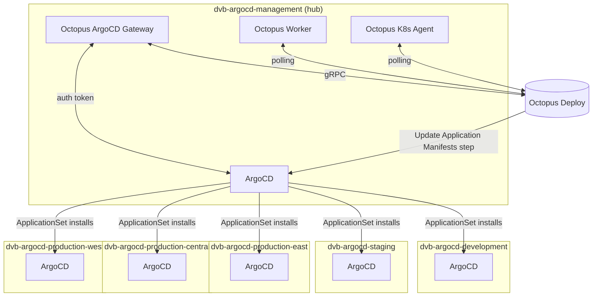
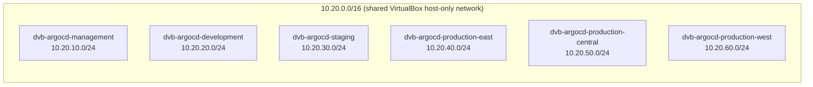
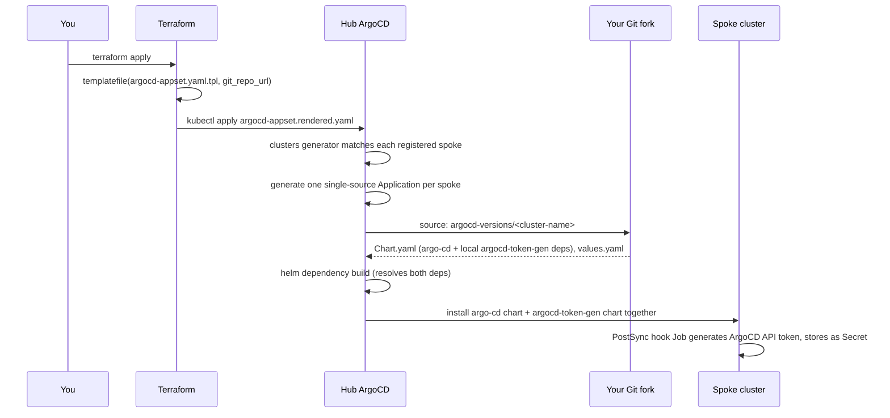
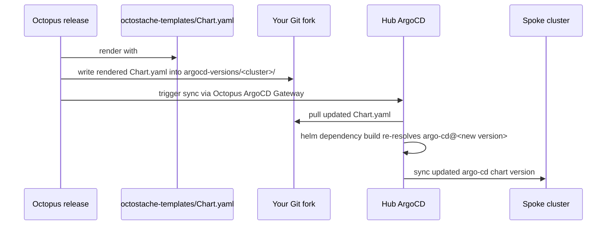

# Usage

A homelab hub-and-spoke ArgoCD platform: six Vagrant-provisioned Kubernetes
clusters (one management "hub" + five spokes), wired together with
Terraform, an ArgoCD ApplicationSet, per-cluster Helm umbrella charts, and
Octopus Deploy driving version promotion.

The management cluster runs ArgoCD and the Octopus ArgoCD Gateway. From
there, an ApplicationSet installs ArgoCD onto each spoke cluster
automatically. Each spoke's ArgoCD chart version is promoted through
Octopus's own release/environment process, via its "Update Argo CD
Application Manifests" step -- not by hand-editing files or running
scripts.

For host machine setup and provisioning the clusters for the first time,
see [SETUP.md](SETUP.md).

## Architecture



Two distinct mechanisms both involve "spokes," worth keeping straight:

| Mechanism | Where it's defined | What it does |
|---|---|---|
| Cluster registration | `terraform/argocd-management-cluster/spoke-clusters.tf` + `modules/argocd-spoke-registration/` | Registers each spoke as an ArgoCD **Cluster** secret on the hub, so the hub's ArgoCD *knows about and can reach* each spoke's API server. |
| Spoke ArgoCD install | `terraform/argocd-management-cluster/argocd-appset.yaml.tpl` | An **ApplicationSet** that uses those registered clusters to *install ArgoCD itself* onto every spoke, via each cluster's own umbrella chart in `argocd-versions/`. |

## Network topology

All six clusters share a single `10.20.0.0/16` private network (one
VirtualBox host-only adapter, `netmask: 255.255.0.0`), so any node in any
cluster can reach any other cluster's API server directly -- no static
routes needed. Each cluster gets its own `/24` slice:



Each control-plane node gets `.11` in its `/24`; workers start at `.21`.

## Repository structure

```
.
├── Vagrantfile                        # Provisions all 6 clusters
├── Generate-RemoteKubeconfig.ps1
├── charts/
│   └── argocd-token-gen/              # Shared local Helm dependency:
│       ├── Chart.yaml                 # RBAC + PostSync hook Job that
│       ├── values.yaml                # generates the ArgoCD gateway
│       └── templates/                 # token on whatever cluster
│           ├── serviceaccount.yaml    # this chart is deployed to.
│           ├── role.yaml              # Referenced by every cluster's
│           ├── rolebinding.yaml       # umbrella chart as a local
│           └── job.yaml               # file:// dependency.
├── argocd-versions/                   # One umbrella chart per spoke
│   ├── dvb-argocd-development/
│   │   ├── Chart.yaml                 # Pins the argo-cd chart version --
│   │   │                              # overwritten by Octopus on deploy
│   │   └── values.yaml                # Helm values for argo-cd (static,
│   │                                  # git-committed, not templated)
│   ├── dvb-argocd-staging/
│   ├── dvb-argocd-production-east/
│   ├── dvb-argocd-production-central/
│   └── dvb-argocd-production-west/
├── octostache-templates/
│   └── Chart.yaml                     # Octostache template Octopus
│                                       # renders and writes into each
│                                       # cluster's own Chart.yaml above
└── terraform/
    └── argocd-management-cluster/     # Terraform root for the hub cluster
        ├── argocd.tf                  # Installs ArgoCD on the hub via Helm
        ├── argocd-appset.yaml.tpl     # ApplicationSet template (spoke installs)
        ├── git-repo-and-appsets.tf    # Repo credential + render/apply the ApplicationSet
        ├── spoke-clusters.tf          # Registers spoke clusters as ArgoCD Cluster secrets
        ├── modules/argocd-spoke-registration/
        ├── octopus-gateway.tf         # Octopus ArgoCD Gateway install
        ├── octopus-worker.tf          # Octopus Worker install
        ├── octopus-agent.tf           # Octopus Kubernetes Agent install
        ├── octopus-environments.tf    # Creates Octopus Environments
        ├── namespaces.tf
        ├── providers.tf
        ├── variables.tf
        ├── versions.tf
        ├── argo-rollouts.tf
        └── terraform.tfvars.example
```

`bootstrap/argocd-token-gen/manifests.yaml`, if still present, is no
longer used -- the RBAC/Job it held now lives once in
`charts/argocd-token-gen/` and gets pulled in as a Helm dependency by
every cluster instead of being referenced as a second Application source.
Safe to delete.

## How a spoke gets ArgoCD installed



The ApplicationSet's cluster generator only matches cluster secrets
carrying an `env` label (set when each spoke is registered), which
naturally excludes ArgoCD's implicit `in-cluster` entry. Each generated
Application uses a **single** Helm source pointing at
`argocd-versions/<cluster-name>` -- the `argo-cd` chart and the shared
`charts/argocd-token-gen` bootstrap Job are both pulled in as Helm
dependencies of that same source, not as separate Application sources.

## How an ArgoCD version gets promoted to a spoke



Octopus's "Update Argo CD Application Manifests" step matches Applications
by scoping annotations (`argo.octopus.com/project`, `.../environment`,
`.../tenant`), not by name -- it writes the rendered template into
whichever Application's source path those annotations point at. Only
`Chart.yaml`'s `argo-cd` dependency version is templated; the local
`argocd-token-gen` dependency and `values.yaml` are static, git-committed
files, edited directly (PR, etc.) rather than through Octopus.

## Octopus scoping annotations

Every spoke's generated Application carries annotations tying it to a
Project/Environment/Tenant in Octopus:

| Annotation | Value | Derived from |
|---|---|---|
| `argo.octopus.com/project` | `argocd-management` (a **slug**, not display name) | Fixed |
| `argo.octopus.com/environment` | e.g. `development`, `production` | First segment of the cluster name after stripping `dvb-argocd-` |
| `argo.octopus.com/tenant` | e.g. `east`, or empty string | Second segment, if present (regional production clusters only) |

`dvb-argocd-production-east` -> environment `production`, tenant `east`.
`dvb-argocd-development` -> environment `development`, tenant present but
empty (an empty-string annotation, not an omitted one -- a constraint of
how ArgoCD's `goTemplate` engine renders values, not a choice).

These are **unscoped** (no `.<source-name>` suffix) because each
Application now has a single source -- confirm the values above actually
match your real Octopus project/environment/tenant **slugs** (visible in
each one's URL/Settings), not their display names; slugs don't always
follow the obvious lowercase-hyphenate pattern, especially after a rename.

## Octopus Deploy as the control plane over ArgoCD

The result of the flow above is that **Octopus, not ArgoCD's own UI, is
where you decide and observe what version is running where.** ArgoCD
still does all the actual GitOps syncing -- Octopus just sits on top of it
as a release/promotion control plane, using its normal
Project/Environment/Tenant model mapped onto the scoping annotations
above.

The **Project Dashboard** shows every cluster's live ArgoCD version at a
glance, organized exactly like any other Octopus deployment: environments
across the top, tenants down the side, an "Untenanted" row for
`development`/`staging` (which have no regional tenant), and a
`central`/`east`/`west` row per tenant for `production`:


Mid-deployment, the same view shows a release actively rolling out (spinner
+ timestamp instead of a static version number) alongside clusters that are
already settled:


Drilling into a specific environment/tenant's **Live Status** view surfaces
the actual Kubernetes resources ArgoCD is managing on that cluster --
pulled through the Octopus ArgoCD Gateway, not screen-scraped -- including
the underlying `Application` resource, its sync/health status, and the
full resource tree (CRDs, ServiceAccounts, the application-controller
StatefulSet, RBAC, etc.):


For comparison, this is the same set of clusters from ArgoCD's own UI --
five `Application` objects, one per spoke, each sourced from
`argocd-versions/<cluster-name>` in this repo:


The practical takeaway: day-to-day version promotion happens by creating
and deploying an Octopus release through its normal Environment/Tenant
lifecycle (Development → Staging → Production/central/east/west) --
ArgoCD's UI is for verifying sync health and debugging, not for deciding
what gets deployed where.

## Common pitfalls (learned the hard way)

- **`templatefile()` treats every `${...}` as a real interpolation, even
  inside a comment.** Illustrative uses of that syntax in `.tpl` file
  comments have to be escaped as `$${...}`.
- **ArgoCD's `goTemplate: true` parses the `template:` block as YAML
  first, then substitutes into individual string values** -- it does not
  render the whole file as text first the way Helm does. `{{- if }}...{{-
  end }}` can't conditionally add or remove a whole YAML key; conditionals
  have to live *inside* a single scalar value instead.
- **Any YAML value that is entirely a `{{ ... }}` expression must be
  explicitly quoted** (`'{{ .foo }}'`), or YAML parses the leading `{` as
  the start of a flow-mapping and fails.
- **The ApplicationSet CRD keeps its own, sometimes-outdated copy of the
  Application schema.** Multi-source Applications with a named
  `sources[].name` can hit `unknown field` errors on some ArgoCD versions
  even though named sources work fine on real Applications -- and
  `--validate=false` does *not* fix this, since the API server still
  structurally prunes unknown fields from the CRD on write regardless of
  client-side validation flags. The actual fix here was avoiding multi-source
  entirely: a single Application source with the bootstrap Job pulled in
  as a Helm dependency instead of a second source.
- **Kubernetes Jobs have an immutable pod template.** `field is immutable`
  from a `kubectl apply` against a Job means something is trying to update
  one in place rather than delete-and-recreate it -- check for name
  collisions between resources meant for different clusters.
- **Splitting a combined multi-resource YAML file into one-file-per-resource
  is easy to get subtly wrong.** A copy/paste slip left `serviceaccount.yaml`
  containing a duplicate `RoleBinding` instead of the actual `ServiceAccount`
  -- `helm template . | grep -A5 "kind: ServiceAccount"` caught it
  immediately; the Kubernetes API silently never created the resource,
  with no error, just a `FailedCreate` on whatever depended on it.
- **Octopus releases pin an exact git commit at creation time.** Pushing
  new commits to your repo doesn't affect an already-created release --
  redeploying it re-runs against the same old commit. If a fix isn't
  showing up, check whether you're redeploying a stale release rather than
  creating a new one.
