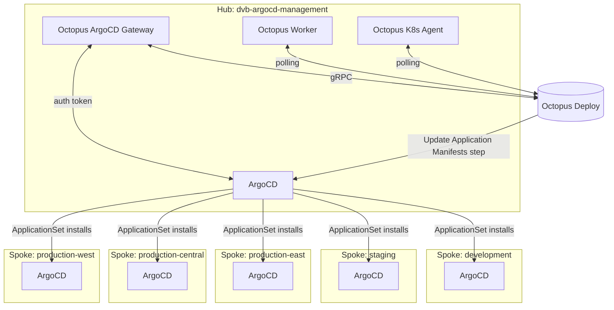
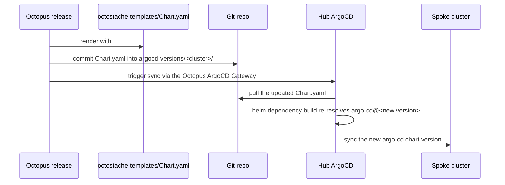

# Giving ArgoCD its own release lifecycle with Octopus Deploy

Every application on your Kubernetes clusters gets a release process.
Dev, then staging, then production, with approvals, environment gates,
and a record of exactly what was deployed where and by whom. Now ask:
what does *ArgoCD's own* upgrade process look like?

For most teams, the honest answer is `helm upgrade argo-cd` run by hand
against each cluster, on whatever day someone remembers to do it. That's
a strange gap, because ArgoCD isn't just another workload — it's the
thing that deploys every other workload. If a bad ArgoCD upgrade breaks
sync, breaks RBAC, or breaks webhook handling, it doesn't take down one
application, it takes down your ability to ship *anything* to that
cluster. The component with the largest blast radius in your entire
platform is routinely the one with the least process around changing it.

This is a prototype for closing that gap: a fleet of clusters where
ArgoCD upgrades itself declaratively across every environment, and
Octopus Deploy governs *when* and *where* each version rolls out, using
the exact same release/environment/tenant model you'd use for any other
application. The code is in
[dvb-argocd-rm](https://github.com/dustinvanbuskirk/dvb-argocd-rm).

## The problem in concrete terms

Treat ArgoCD like any other piece of software running in production, and
a few requirements fall out immediately:

- **A version shouldn't reach production clusters until it's proven
  itself somewhere lower.** Dev, then staging, then production — the
  same gate you'd insist on for an application chart.
- **Every version change needs a record.** Who promoted it, when, to
  which cluster, and — since ArgoCD upgrades occasionally do go wrong —
  a way to see what was running before.
- **Regional production clusters need independent control.** A
  problematic version showing up in `production-east` shouldn't already
  be running in `production-central` and `production-west` at the same
  moment.
- **The process shouldn't depend on someone remembering to run a
  command by hand** against five (or fifty) clusters in the right order.

None of that is unusual — it's just the normal bar for a release process.
What's unusual is applying it to the control plane instead of to the
applications the control plane deploys.

## The shape of the solution

Split the work into two halves that are good at different things.
**ArgoCD** is good at reconciling declared state onto clusters — so it's
what actually installs and upgrades itself, fleet-wide, via an
ApplicationSet. **Octopus** is good at governed promotion — environments,
tenants, lifecycles, approvals, audit history — so it's what decides
which version each cluster's ArgoCD should be reconciling toward, without
ever touching a cluster directly.

One management cluster (the hub) runs ArgoCD plus the Octopus ArgoCD
Gateway, an Octopus Worker, and an Octopus Kubernetes Agent. Five spoke
clusters — development, staging, and three regional production sites —
each run nothing but ArgoCD, installed and upgraded entirely from the
hub.



Two distinct mechanisms make this work, and it's worth keeping them
straight since both get called "spoke" management:

| Mechanism | Where it lives | What it does |
|---|---|---|
| Cluster registration | `spoke-clusters.tf` | Tells the hub's ArgoCD a spoke exists and how to reach it (a standard ArgoCD `Cluster` secret). One-time bookkeeping, done via Terraform. |
| Version promotion | Octopus, via an Octostache template + the ArgoCD Gateway | Decides *which ArgoCD version* each spoke should be running right now, following a normal Environment/Tenant lifecycle. This is the part that runs continuously and the part this post is actually about. |

## Mechanism: ArgoCD installs itself, fleet-wide

The plumbing that makes "no one runs `helm upgrade` by hand" possible is
ArgoCD's [cluster
generator](https://argo-cd.readthedocs.io/en/stable/operator-manual/applicationset/Generators-Cluster/),
normally used to fan an application out across every registered cluster.
Point it at ArgoCD's own Helm chart instead, and a list of clusters
becomes a fleet that reconciles its own control plane:

```yaml
generators:
  - clusters:
      selector:
        matchExpressions:
          - key: env
            operator: Exists
```

Every registered spoke carries an `env` label; ArgoCD's implicit
`in-cluster` entry doesn't, so it's excluded automatically. For each
match, the template generates one Application whose source is a
per-cluster directory in git — `argocd-versions/dvb-argocd-production-east/`,
and so on — each holding a thin umbrella chart around upstream `argo-cd`
plus a small bootstrap dependency that mints an API token for the
Gateway once ArgoCD comes up. Add a sixth cluster and there's no
ApplicationSet YAML to touch: register it, label it, and the generator
picks it up on the next reconcile.

This part solves *fleet-wide installation*. It does nothing on its own to
solve *governed promotion* — left alone, every spoke would just track
`targetRevision: main` and pick up whatever version last landed in git,
with no gate and no record of who approved it. That's the piece Octopus
adds.

## Mechanism: Octopus governs what "main" means, per cluster

The only thing Octopus is allowed to change is one version string, in
one file, per cluster — the `argo-cd` dependency version in that
cluster's `Chart.yaml`. Everything else about the deployment (RBAC, the
bootstrap Job, Helm values) stays a normal git-committed file, reviewed
through PRs the way you'd review any other config change. That narrow
surface area is deliberate: the thing being promoted through a release
lifecycle is exactly one version number, not an arbitrary blob of
manifests.

`Chart.yaml` is generated from an Octostache template via Octopus's
**Update Argo CD Application Manifests** step:

```yaml
dependencies:
  - name: argo-cd
    version: "#{Octopus.Release.Number}"
    repository: https://argoproj.github.io/argo-helm
  - name: argocd-token-gen
    version: "0.1.0"
    repository: "file://../../charts/argocd-token-gen"
```

Deploying an Octopus release renders that template, commits the result
into the target cluster's path in git, and triggers a sync through the
Gateway. ArgoCD picks up the change the normal GitOps way:



Octopus knows which of the hub's Applications maps to which cluster
through scoping annotations set at Application-generation time — matched
by annotation, not by name, so renaming a cluster's Application later
wouldn't break promotion:

| Annotation | Example value | Derived from |
|---|---|---|
| `argo.octopus.com/project` | `argocd-management` | Fixed — one Octopus project governs the whole fleet |
| `argo.octopus.com/environment` | `development`, `production` | Cluster name segment after `dvb-argocd-` |
| `argo.octopus.com/tenant` | `east`, or empty string | Regional segment, for the three production clusters only |

That's what turns "five clusters somewhere" into "Development, Staging,
and Production × {central, east, west}" — a shape any DevOps team already
recognizes, using Environments and Tenants that plug into the same
lifecycle, approvals, and scoped variables as everything else in the
Octopus project.

The payoff shows up in the Project Dashboard: every cluster's live
ArgoCD version, in one view, laid out by environment and tenant exactly
like any other Octopus-managed rollout:


Mid-rollout, the same view shows exactly which clusters have already
picked up the change and which are still catching up — no guessing, no
tab-switching between five ArgoCD UIs:


And because the Gateway is a real read path into ArgoCD's API, not a
scrape, drilling into a specific environment/tenant surfaces the actual
`Application` resource and its full managed resource tree — sync status,
health, the application-controller StatefulSet, RBAC — without leaving
Octopus:


ArgoCD's own UI still exists, and still shows the same five Applications
— it's just no longer where the decision gets made:


Two properties fall out of this for free, and both matter more for a
control-plane component than for an ordinary app:

- **Releases are immutable.** An Octopus release pins an exact git
  commit at creation time. Redeploying an existing release re-runs
  against that same commit — it can't silently pick up a newer, untested
  change. If you need to ship a fix, you cut a new release, which means
  there's always an unambiguous answer to "what commit is
  `production-east` actually running."
- **Rollback is the same operation as roll-forward.** Since promotion is
  just "deploy a release to an environment," reverting a bad ArgoCD
  version to a cluster is redeploying the prior release — no special
  break-glass procedure for the one component that, if it breaks,
  affects every other deployment on that cluster.

## Where this leaves things

ArgoCD still does all of the actual GitOps work — installing itself,
syncing itself, healing itself. Octopus never touches a cluster directly;
it changes one version string in git and lets ArgoCD do the rest. What
that buys a DevOps team is the thing that was missing: the component
responsible for deploying everything else gets promoted through the same
staged, audited, approvable process as everything else — instead of
being the one piece of the platform everyone's afraid to touch.

The full prototype — Terraform, the ApplicationSet template, the
per-cluster Helm umbrella charts, and the Octostache template — is in
[dvb-argocd-rm](https://github.com/dustinvanbuskirk/dvb-argocd-rm).
